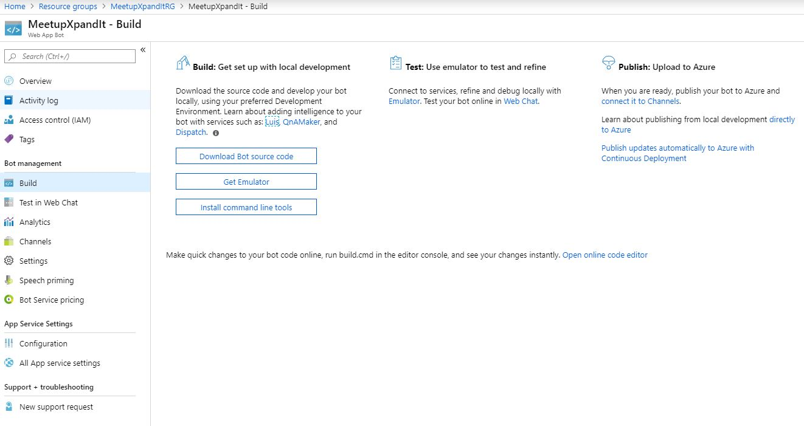
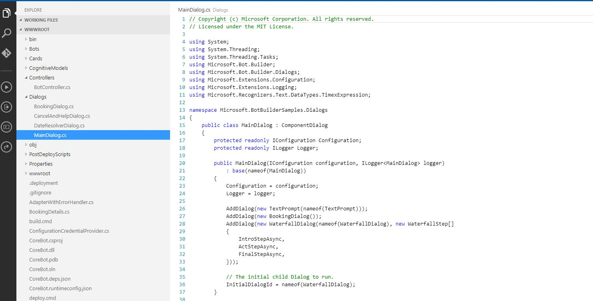

## Check the Web App Bot Code

Still in the Web App Bot you can go to the build Section.

In this section you can download the code, but also open the online Editor. Click in the "Open online code Editor".

In this editor you heve a folder called Dialogs, in this folder you can see the MainDialog.
In the lines 26 to 28, the code is calling another dialog.

In the BookingDialog, you can see all the questions and steps, that were made when you test the bot.

Now, let's [Create a slack Channel](https://github.com/xpandit/landingjobs_cognitiveservices/blob/master/CreateIntent.md)
