## Create a Slack Channel

In order to connect you bot to Slack you need to have a slack account.

After Login you can go to https://api.slack.com/apps

In here you create a app

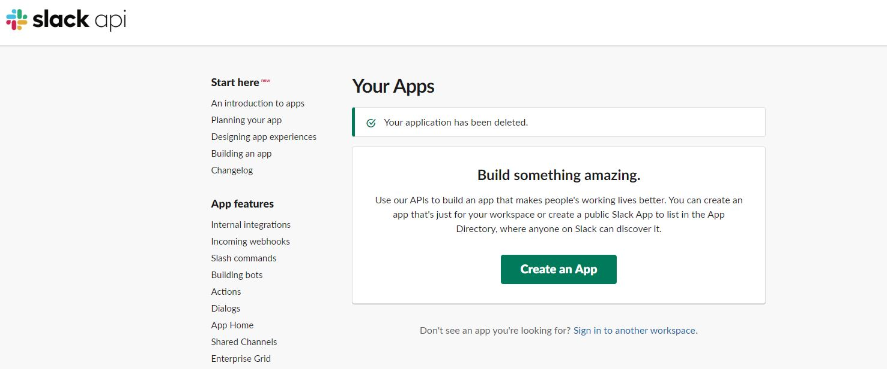

A popup will appear, so you can add the app name and the workspace
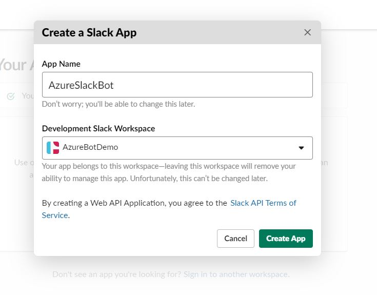

After creation go to OAuth & Permissions and add the redirect
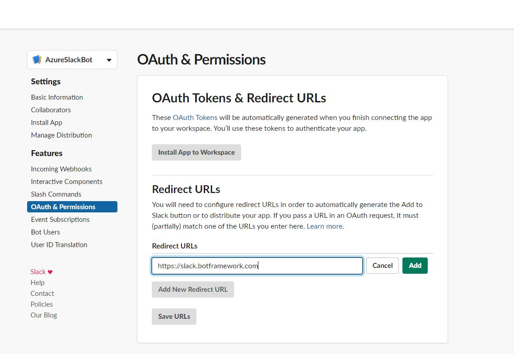

In the Bot Users, click a new Bot User
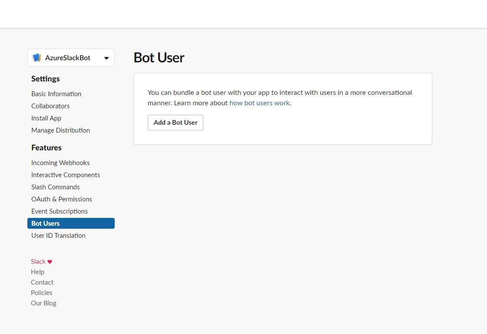

Fulfill the display name of the bot
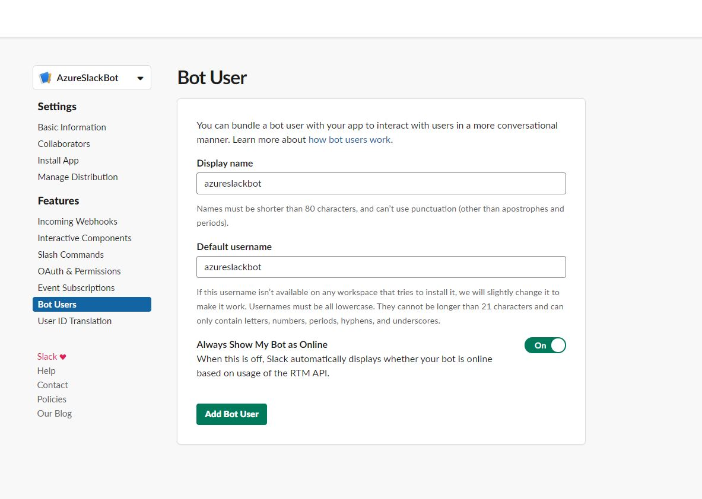

Go to event Subscription and add the request url https://slack.botframework.com/api/Events/{YourBotHandle}

To know your bot handle go here https://dev.botframework.com/bots
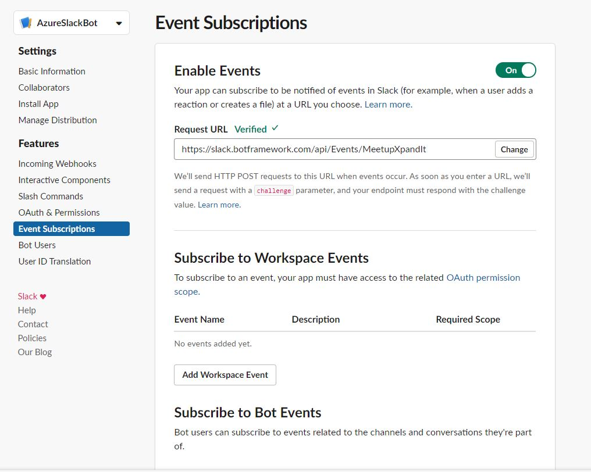

After add the request URL subscribe the following events
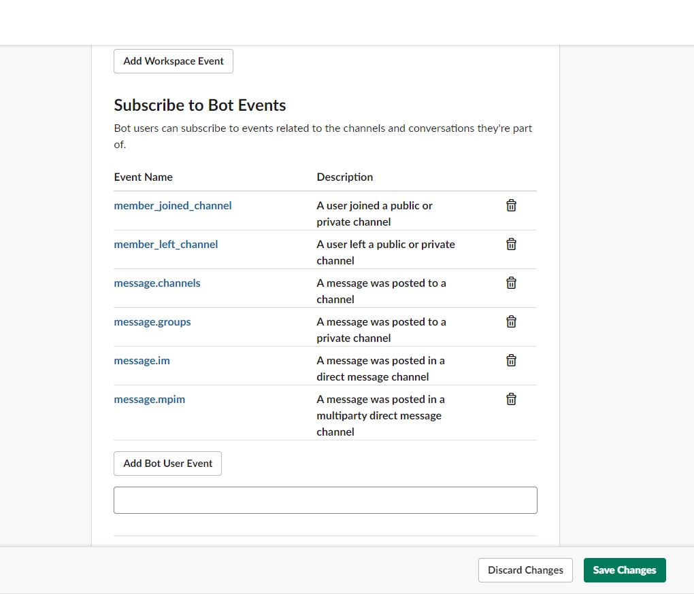

Go to Interactive Components and add the Following Request URL https://slack.botframework.com/api/Actions
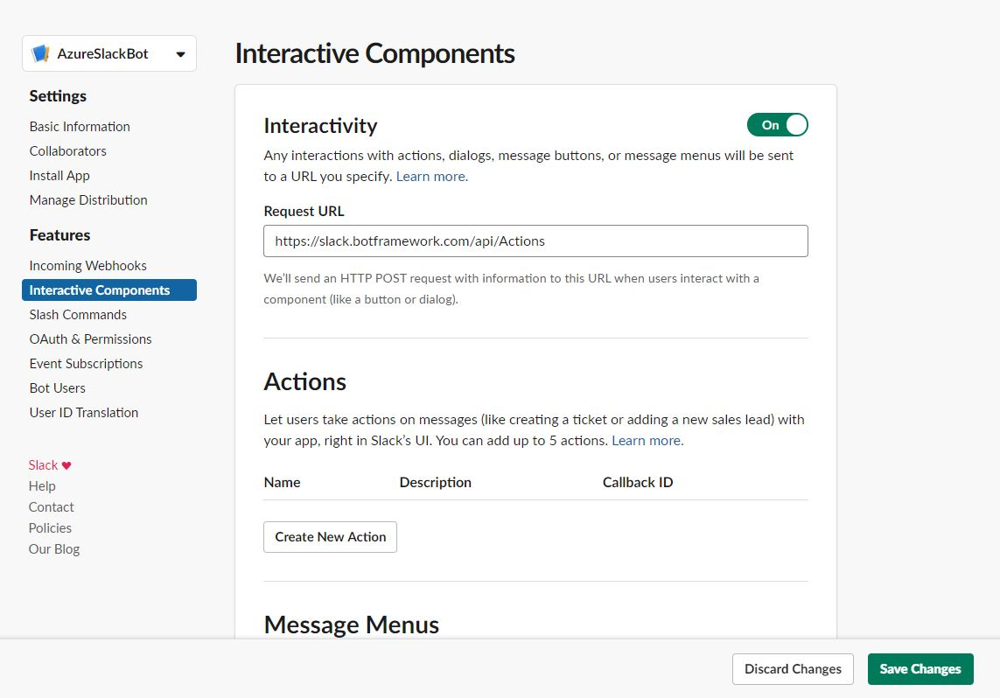

Select the Basic Information tab and scroll to the App Credentials section. Copy the credentials, it will be necessary in the channel of the web app bot
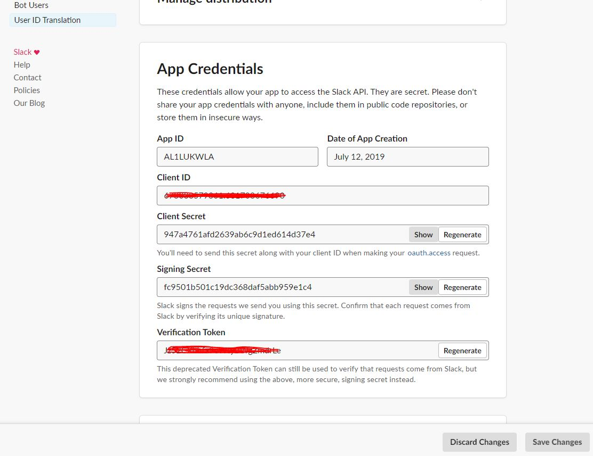

In your azure account, go to the Channels in the Web App Bot
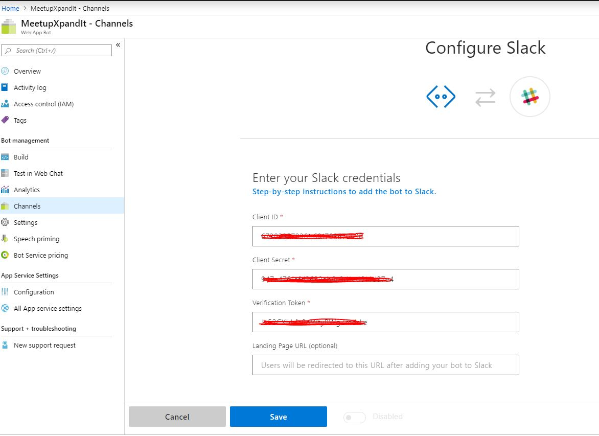

Click Save and confirm you identity.
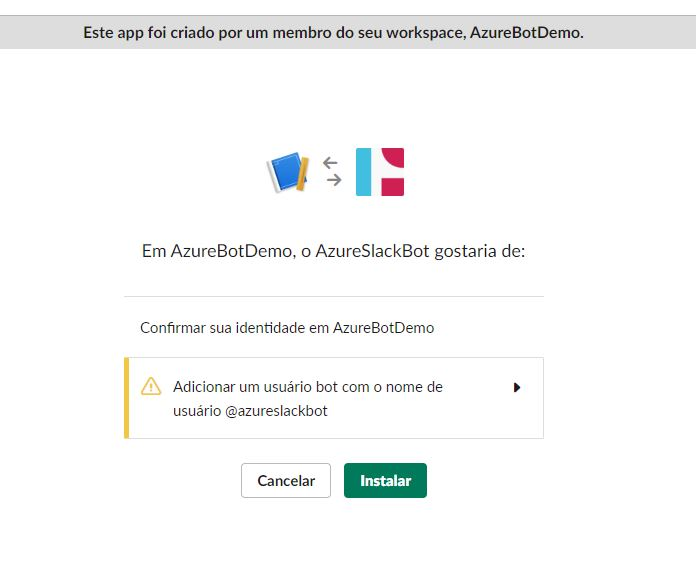

Go to your slack workspace, click in your app bot and test you bot
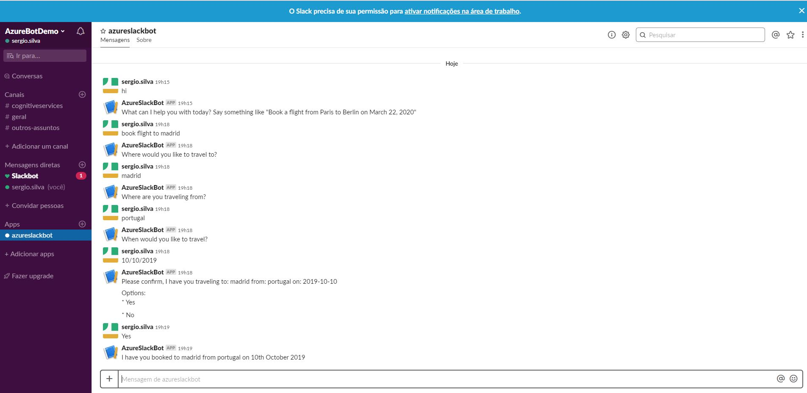

Now, let's [Create a slack Channel](https://github.com/xpandit/landingjobs_cognitiveservices/blob/master/CreateIntent.md)
