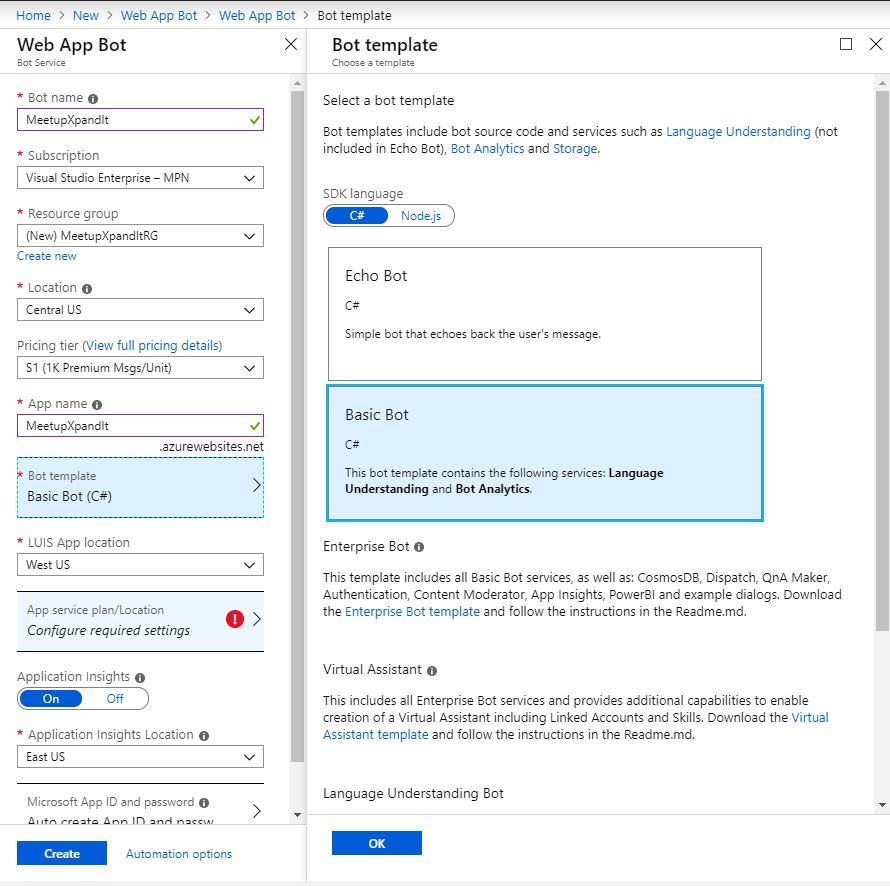
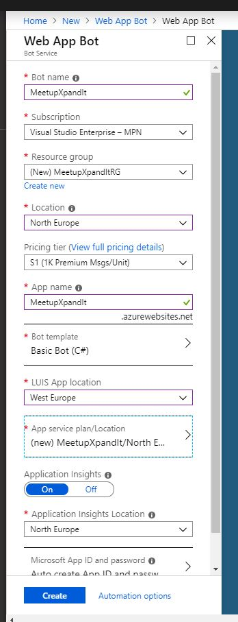
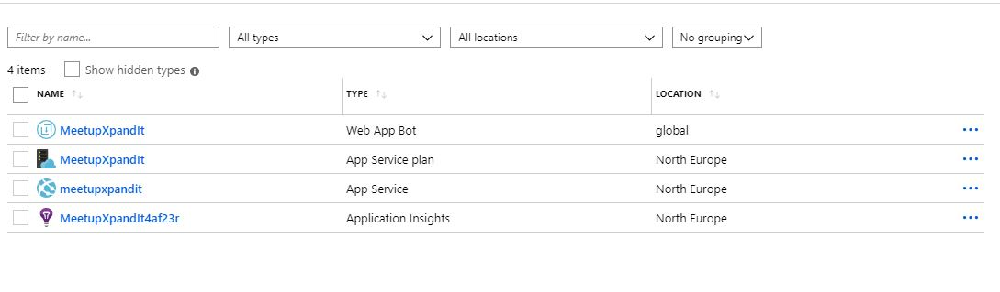
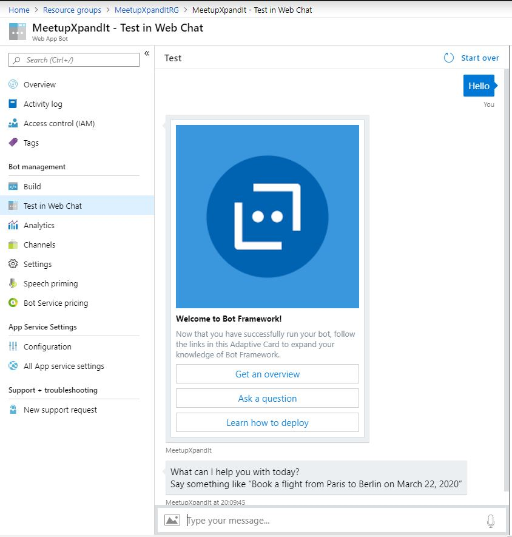
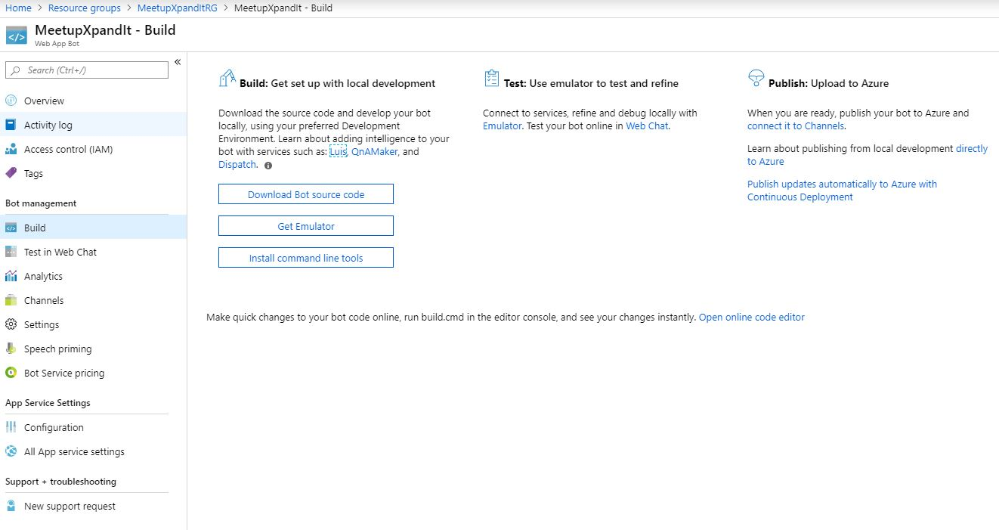
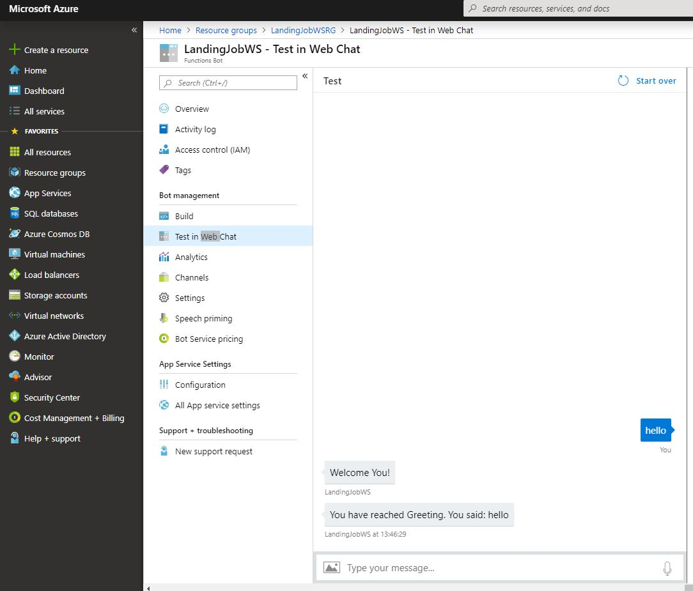

## Creating a Web App Bot

We're going to start with a simple bot and just start conneting the slack to it.

## We'll start preparing the bot

First Create a Web App Bot in [azure](https://portal.azure.com/)

**Remember to use the Basic bot**

After fulfill all the fields click create

You can test it directly in the web chat, it's using a common LUIS

Now, let's [Create an Intent](https://github.com/xpandit/landingjobs_cognitiveservices/blob/master/CreateIntent.md)