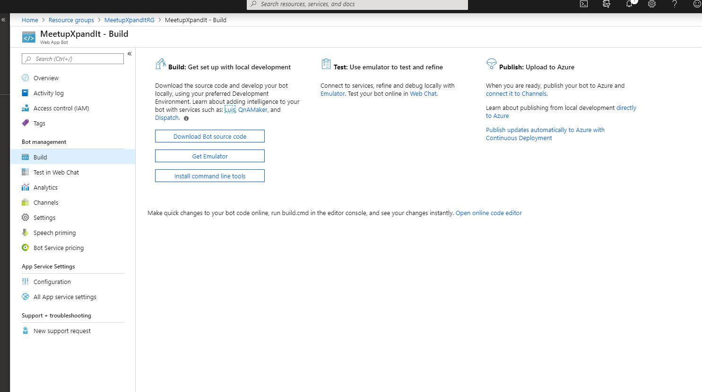
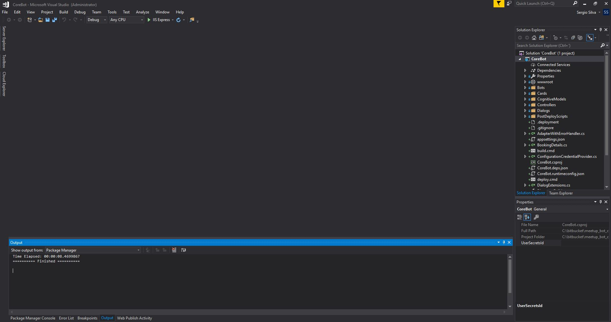
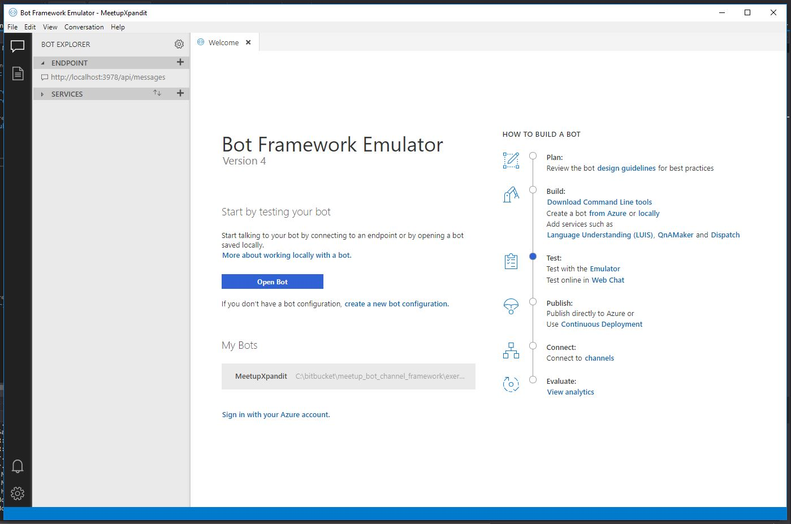
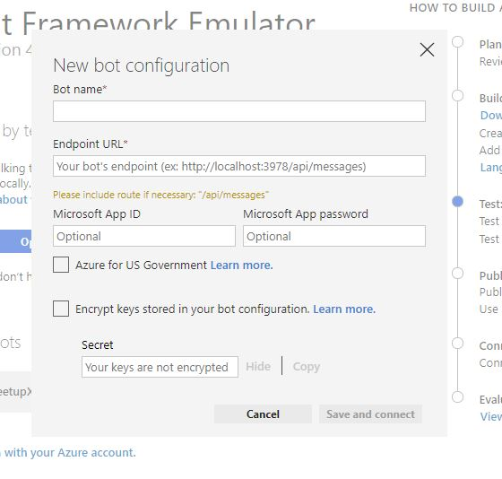
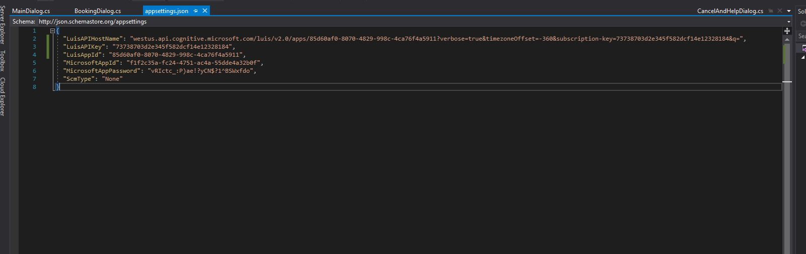
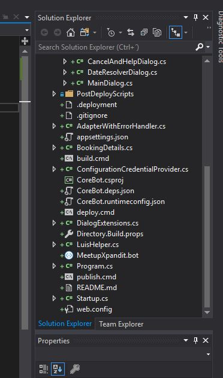
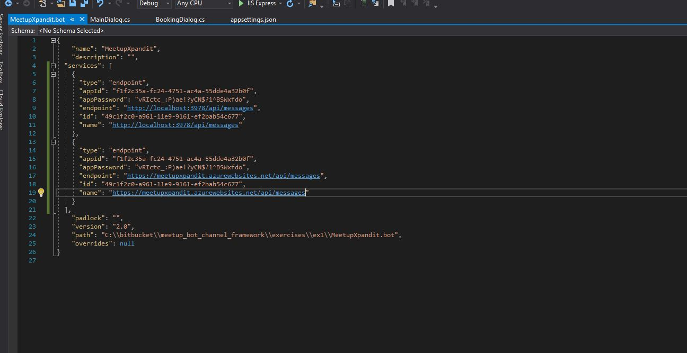
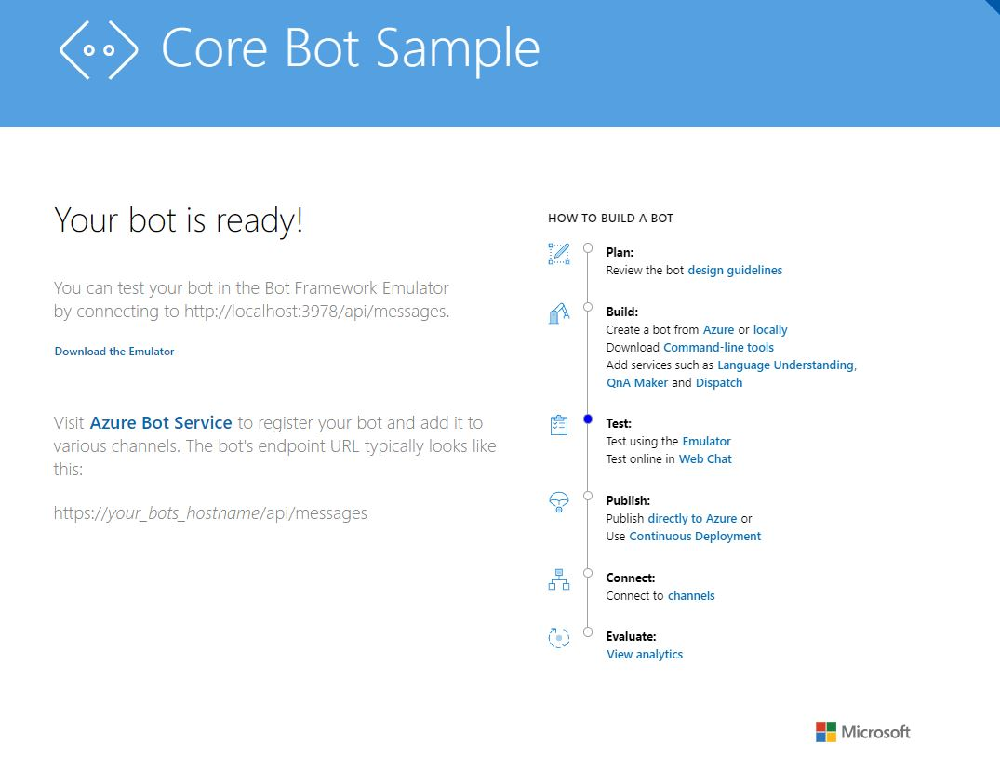
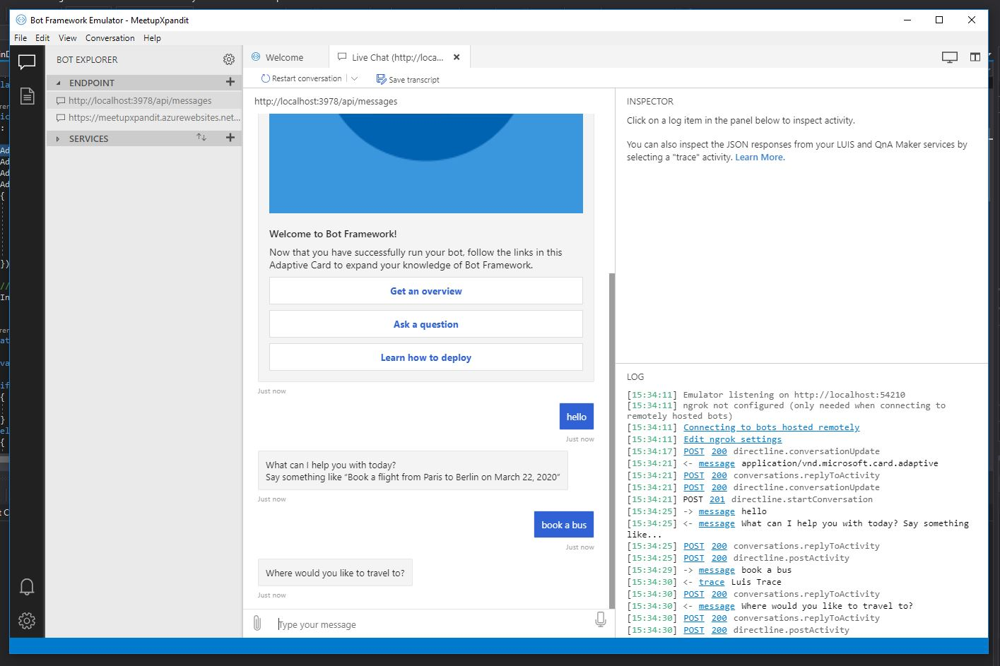

## Download and configure the bot framework

First install the bot framework template, you can found it in here https://marketplace.visualstudio.com/items?itemName=BotBuilder.botbuilderv4

Also install the bot emulator, you can found it in here https://github.com/microsoft/BotFramework-Emulator

Go to the Web App Bot, and then to the build section. In here click in the "Download Bot Source Code"

Open the solution, as you can see, it's the same that we saw previously

Open the bor emulator, and create a new bot configuration.

in here Enter a bot name, url in this case can be the localhost. Also add the app Id and password, you can found them in the appSettings

In the AppSettings, Add the endpoint url, AppId and API KEY of your luis application.

Save the bot in your solution

Open the .bot file configuration, copy and paste the service, change the id, and change the endpoint and name, to the Messaging endpoint found in your web app bot.

Run the project

Test in the bot framework

Now, let's [make a change and publish](https://github.com/xpandit/meetup_bot_channel_framework/blob/master/MakeChangeAndPublish.md)
