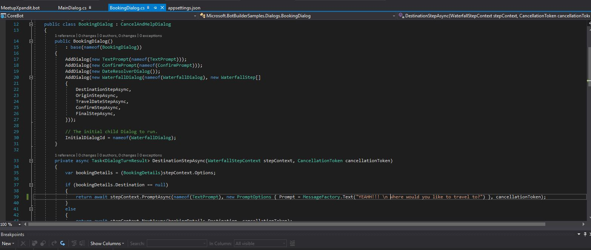
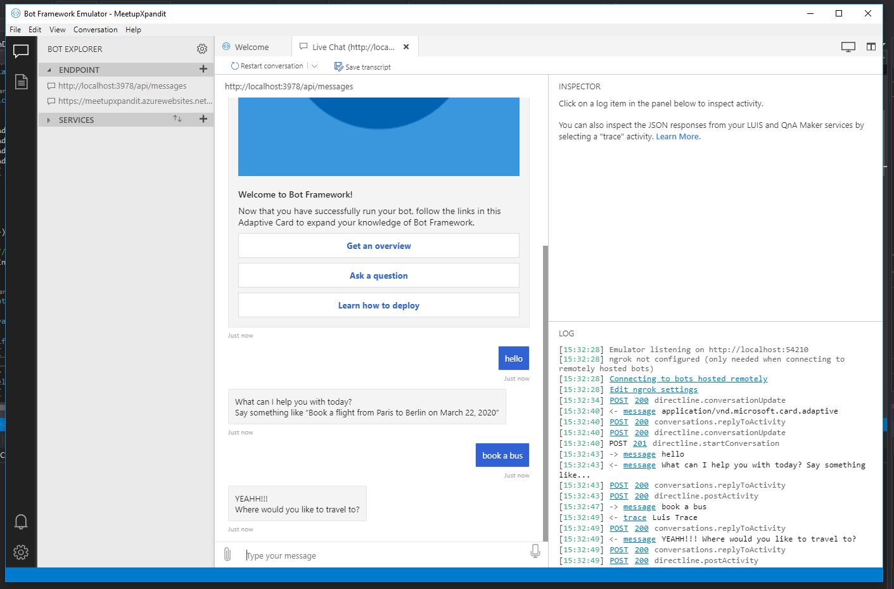
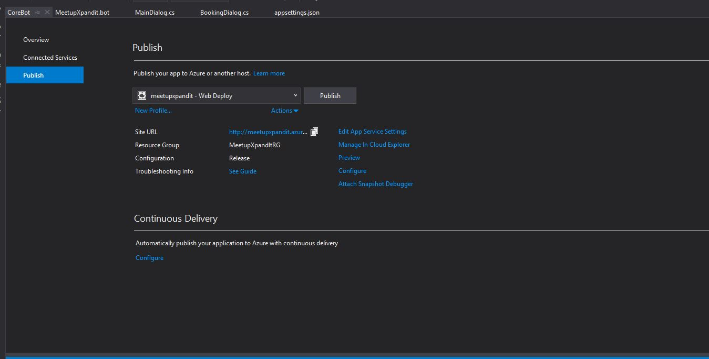
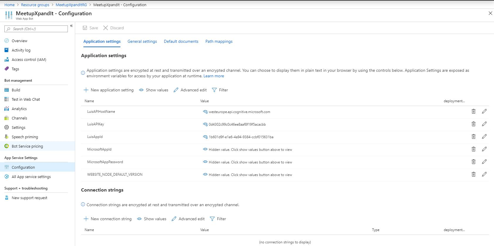
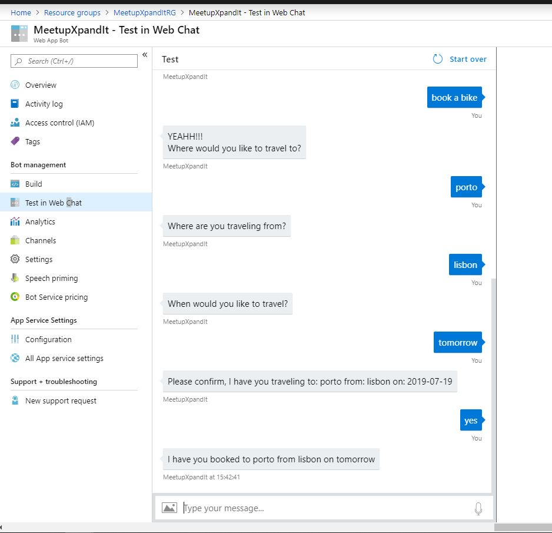

## Make a change and Publish

Go to the BookingDialog, make a change to a message

Run the project, and check that the message change

publish the solution to the Web App Bot

Change the configurations of the Web App Bot, in order to connect to the luis.

Test in the Web Chat or slack.

Now, let's [check what happen in LUIS](https://github.com/xpandit/meetup_bot_channel_framework/blob/master/ImportLUtoLUIS.md)
