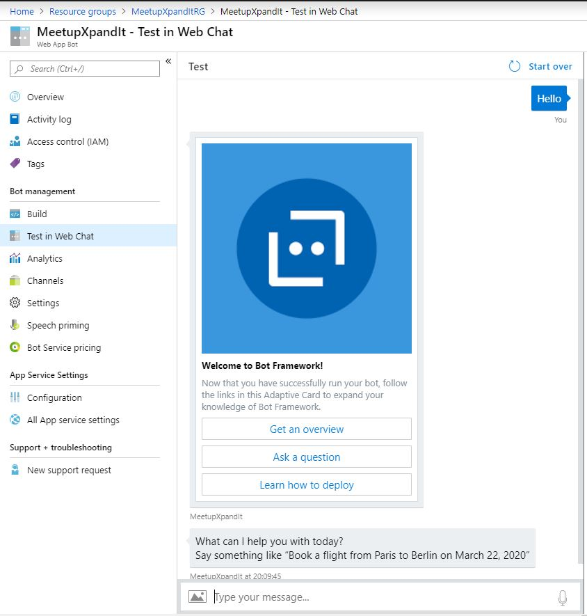

## Test the Web App Bot

In the Web app bot you have all the options that were present in the function bot. 
the difference is, now instead of azure functions, you will have a web api.

If ou go to the "Test in Web Chat", you can test the Bot, the bot framework and a generic LUIS. 

In this case this bot have a booking flight dialog.

Now, let's [Check the Web App Bot code](https://github.com/xpandit/meetup_bot_channel_framework/blob/master/CheckWebAppBotCode.md)
